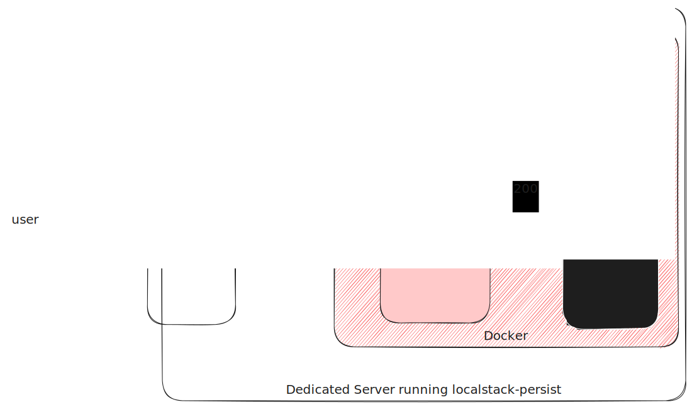

# Securing localstack instances



## Requirements

- This project
- Either docker or a node.js-enabled environment

## Setup

### Example config using docker:

Create a `docker-compose.yaml`. Paste the following:

```yaml
version: "3.8"
services:
  localstack:
    image: gresau/localstack-persist # instead of localstack/localstack
    environment:
      SKIP_SSL_CERT_DOWNLOAD: 1 # Needed for localstack instances hidden from the internet.
    volumes:
      - "./my-localstack-data:/persisted-data"
    networks:
      - backend

  localstack-security:
    image: hobart2967/localstack-security # or just 'localstack-security' if built locally using `yarn build`
    volumes:
      - "./config.json:/usr/share/localstack-security/config.json" # Overwrite config as you wish.
    networks:
      - backend

  nginx:
    image: nginx
    volumes:
      - ./nginx.conf:/etc/nginx/conf.d/proxy.conf
    networks:
      - backend
      - frontend
    ports:
      - 8675:8675

networks:
  backend:
    internal: true
  frontend:
    internal: false
```

This will host three services:

- NGINX - You do not need this one, if you already have one - or an alternative - running.
- LocalStack - You do not need this one, if you have one running.
- LocalStack Security layer - This is the service provided by this repository.

If you kill either one of LocalStack or NGINX, you will need to ensure that only NGINX is reachable from outside. Neither localstack nor the localstack security should be reachable from outside.

### Configuration

The service layer is accessing a `config.json` which is located at the current working directory chosen when starting the service. You can configure the following properties:

```json
{
	// Least level of logging (can be debug, info, warn or error)
  "logLevel": "debug",

	// Port that the security layer should be running on
	"port": 4387,

	// Uri of localstack (needs to be accessible from the server serving the security layer)
  "localStackUri": "http://localstack:4566",

	// List of Regular Expressions causing a whitelisting of paths (ignoring AWS Sigv4 headers) (see regex101.com for phrasing regex :) )
  "whitelistedUris": [
		"/my-public-area/.*"
  ],

	// Key-Value Pairs of allowed AccessKeyId:SecretAccessKey
  "accessKeys": {
    "my-access-key": "my_secret_key"
  }
}
```

### NGINX Config

If configuring your own nginx server, make sure to include a location proxying all requests to the security layer:

```
location / {
	root   /usr/share/nginx/html;
	index  index.html index.htm;
	proxy_set_header Host cloud.codewyre.net;
	proxy_set_header X-Forwarded-For $remote_addr;
	proxy_pass http://localstack-security:4387;
}
```

### LocalStack

Make sure that your localstack setup is not available to the internet. It should be accessed via the security layer.